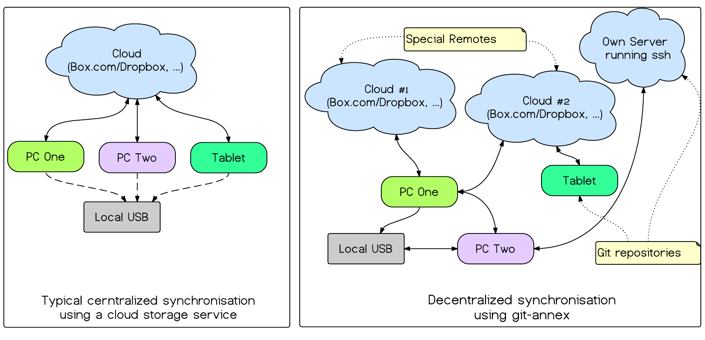

# Introduction

The demand on data access is growing day by day. Today a lot of user have
multiple devices like a pc,  a laptop, a tablet pc or a smart phone. It is also a
comfortable way to synchronize e.g. photos with friends or sensible documents
with co--workers. 

To keep all important files (e.g. documents, photos) in sync, a synchronisation
tool is needed. Cloud storage services are also often used as backup location
for private or commercial data. As devices are not inevitably connected directly
with each other, a cloud storage service is used as a intermediary. Widely used
cloud storage service providers are Dropbox, Box.com, Google Drive, Apple iCloud
and Microsoft OneDrive @storageproviders.

There are known issues with cloud storage services which may cause data loss
@dbsync or unauthorized access @dbpass to private data. Your
data also might be unaccessible when a provider gets taken down by the FBI
because of piracy allegations @piracy. Another point is that the user doesn't
know if his private or commercial data gets encrypted properly. Also there might
be a privacy issues because of PRISM @prism. Usually there is always the
problem with most of the cloud storage services provides that used tools and
methods are not transparent.

To keep data nevertheless accessible and secure backups and the use of
encryption is advisable. When backing up data, one should always bear in mind
that hardware is also very error prone @ramhdd, @bitrot.

To sum up, just doing a backup is not enough to keep data safe and secured. It
is also necessary to check the data's integrity (checking if data is
unchanged/valid). Therefor a backup and restore strategy (validating the
integrity of data) is needed.

There are numerous ways check or ensure data integrity. One possibility would be
to use filesystems like `ZFS` or `BTRFS` which by itself ensure that your data
doesn't get corrupted. These filesystems have the ability to detect and avoid
avoid data corruption @dataintegrity. Another possibility to identify data
corruption is by checksumming @checksum the data. 

To keep the data secured and avoid unauthorized access encryption a proven
standard encryption should be used @cryptography. 

To implement above backup strategy usually different tools are needed. Another
concept that also intends to deal with the issues above is `git-annex`. It is a
tool for file synchronisation and archival purposes. This paper aims to give a
introduction to the `git-annex` basics and its core features.

# Git-annex overview

## Project details

The tool named `git-annex` is a tool that aims to synchronize one's data while
addressing all the issues that automatically come with cloud storage services
and hardware.

`Git-annex` was started as a crowd funding project by Joey Hess, former Debian
GNU/Linux developer. Targeting the project at \$3.000 it reached over \$20.000
within a few hours. `Git-annex` is written in Haskell, a functional programming
language. It has been written in Haskell and not as a *script*-tool as Joey Hess
wanted to provider a decent and stable tool with a decent test suite.

Git annex is a free software tool (free and open source) on top of git. Git is a
``distributed`` version control used by developers to mange source code, see
@progit.
However, git is not suitable for big binary data as it is calculating
differences for all file changes and storing the complete history of a file that
changes. This allows the developer to ,,rollback" the source code state to a
previous version. Doing this with big binary data the repository becomes very
large.

`Git-annex` addresses this problem by only managing the files meta data within
git. While this might seem paradoxical for the first moment, is has a lot of
advantages to do so with files which cannot be handled with git by itself.
Primary `git-annex` is developed as a command line tool. In the meantime there
is also a fancy web-based GUI that allows the non-technical user to use
`git-annex` for file synchronization in a comfortable way like using e.g. the
Dropbox--Client.

The `git annex`-tool is available for all major operating systems like *linux*,
*bsd family*, *mac os*, *android* and *windows*. 

# How it works

## Distributed file synchronisation concept

The `git-annex` synchronisation concept differs from the usual centralized
synchronisation concept in many ways. The ,,old-fashioned" concept usually
synchronized one or more devices to a cloud service, often there is only a peer
(device) to peer (cloud) synchronization possible. Additionally there also might
be a local backup if the user takes care of important data.

To get a idea how a `git-annex`-based setup might look like compared to the
usual centralized way, see [Figure 1](On the left there is the typical
synchronization scenario involving a cloud storage service. On the right you see
a typical distributed git-annex synchronization setup).

**Alternatives**: There are also some other tools like e. g. git-media,
git-bigfiles or git-fat which extend the capabilities of `git`. Besides those
tools extend the `git` concept of using git in conjunction with big files, the
follow different approaches to solve different project. The `git-annex` concept
is in its way unique, as the other projects itself. For more details see
@gitfat, @gitbigfiles, @gitmedia and *what git-annex is not*
@gitannexisnot.

## Git annex internals

The `git-annex` concept is based on usual `git` repositories. Meta data is
synchronized between repositories. A repositories is the place where a copy of
your meta data is stored. As `git` works in a distributed way, `git-annex` is
able to share files across different repositories also in a distributed way,
compared to the usual way using cloud storage provider, where usually a
centralized approach is used. For more information about `git` see, @progit.

A `git`-repository is containing a `.git`-folder which contains information
about the repository like, available remotes, user identity and so on. For a
complete list see @dotgit. `Git-annex` extends this folder structure by adding
a `annex` folder to it. In this location `git-annex` related information is hold.

When adding a file to `git-annex`, the file gets moved to the
`.git/annex/objects/`-folder and a symbolic link to the data is created by
default. This is a `git-annex` feature to avoid unwanted manipulation of the
data. The filename itself is renamed in a way which name represents the
cryptographic hash sum of the data itself. The files are stored in a key-value
manner according in the so called *backend*. In this way e.g. the data's
integrity might be validated by `git-annex fsck`. For a complete list with
supported backends see @backends. The ,,symbolic link"-behavior is called `git
annex indirect`-mode. To can get more information about the configuration of a
repository you can run the `git annex info` command inside the repository.

~~~bash
    $ git annex info
    repository mode: indirect
    trusted repositories: 0
    semitrusted repositories: 2
            00000000-0000-0000-0000-000000000001 -- web
            d9b74881-8579-48ef-8964-9fc445f2978d -- myrepo [here]
    untrusted repositories: 0
    transfers in progress: none
    available local disk space: 56.52 gigabytes (+1 megabyte reserved)
    local annex keys: 1
    local annex size: 5 bytes
    annexed files in working tree: 1
    size of annexed files in working tree: 5 bytes
    bloom filter size: 16 mebibytes (0% full)
    backend usage: 
            SHA256E: 2

~~~

As the symbolic link approach is not always a wanted behavior, there is also the
`git annex direct` mode. This mode is also used when symbolic links are not
supported by the filesystem, this is the case when using a filesystem like the
fat-filesystem. The `direct` mode is also used by the `git annex assistant`,
see [assistant](#assistant).

The repository and remote configuration itself is saved inside the `.git/config`
file. This file is provided by `git` and extended by `git-annex` for its
purposes. A repository is represented by a unique id (UUID), a typical extended
`.git/config` file:

~~~bash
[core]
	repositoryformatversion = 0
	filemode = true
	bare = false
	logallrefupdates = true
[annex]
	uuid = 59a11cf0-0c01-4298-bb94-71c6593caa5b
	version = 5
[remote "temp"]
	url = /tmp/gannex
	fetch = +refs/heads/*:refs/remotes/temp/*
	annex-uuid = b6e1928e-af46-4478-88e1-d17882fdc9f7
~~~

#Introduction to git annex usage

As `git-annex` is primary a command line tool developed by developers for power
users. But in meantime there is also a fancy GUI-based tool called [git annex
webapp](#webapp). It is a part of the [git annex assistant](#assistant). This
chapter gives a short introduction to the way `git-annex` can be used. Basic
usage commands are demonstrated only. For a complete list of command and
possibilities of `git-annex` see the manpage (`man git annex`) or type `git
annex` inside the repository to get a list of all possible commands.

## Commandline usage 

**Creating a git-annex repository**: To initialize a `git-annex`-repository first
you have to initialize a `git`-repository. The complete procedure looks as the
following shell session demonstrates:

~~~bash
    $ git init 'repositoryname'
    $ cd 'repositoryname'
    $ git annex init 'annex-repository-name'
~~~

The created `git`-repository now may be modified using the usual `git`-commands.
Adding a remote repository for synchronization can be achieved by running the
`git remote add <repo-name> <repo-path>` command.

**Adding files to a git-annex repository:** All data manipulation commands are
related to the `git-annex`-command set. A complete procedure looks this way:

~~~bash
    $ git annex add filename.ext
    $ git commit -m 'file added.'
~~~

**Synchronizing repository with remotes:** After adding files to a repository
the metadata is updated with the ,,connected" repositories (remotes) by pulling
changes from the wanted remote and pushing current changes to the remote. 

~~~bash
    $ git annex pull <remotename>
    $ git annex push <remotename>
~~~

This is the way synchronization is realized when using `git` or `git-annex`.

Committing files on every change might seem very uncomfortable, because of the
reason there is a monitoring daemon included in `git annex`. To automate the
complete procedure the daemon can be started by running `git annex watch`. Now
all files added to the directory are committed automatically. 

## Git-annex assistant {#assistant}

The assistant tool allow `git-annex` to implement a completely automated
synchronization the way like Dropbox Client similar synchronisation tools work.
By default only metadata is synchronized. Applying the `--content` option to the
git annex assistant client will tell `git-annex` to synchronize the content too.

## Git-annex webapp {#webapp}

The webapp of `git-annex` is a part of the `git annex assistant`. Running the
command `git annex webapp` starts a `git-annex` service listening on localhost. 

The webapp allows the configuration and management of repositories and remotes
in a user friendly way.

Figure [figure](#Git annex webapp syncing files.) shows the `git annex webapp`. Using the webapp the user has
the possibility to setup `git-annex` repositories completely command line free.
It is also possible to configure `special remotes` and use features like
file encryption. The purpose is also to provider a ,,Dropbox like" user
experience.

The webapp GUI has also a interactive pairing feature for
clients in the local network. Besides this feature stuff like periodical file
integrity check or *XMPP*-account for file sharing (synchronisation) with
friends or not directly connected devices is possible. Also there is a log file
and the option to restart or shutdown the git annex daemon.

# Git-annex features

## Repository Groups

`Git annex` introduces `repository groups` as a way to specify the behaviour of
a repository. Using `repository groups` gives the user more control about the
way how a repository behaves. For example if a repository is used as a *backup*
repository, all synchronized files get accumulated. There are also `repository
groups` for archival purposes. User repositories are usually  in the *client*
group. Repositories used to exchange between not directly connected devices are
typically in the *transfer group*. `Repository groups` can be controlled by
using `git annex vicfg`. For a complete list of `repository groups` see
[^repositorygroups].

## Special Remotes

`Git-annex` extends the `git` repository concept by introducing `special
remotes`. These remotes can by used like typical `git`-repositories,
`git`-commands however cannot be used. Typical special remotes are cloud storage
services like `Amazon S3` or `Box.com`. For a complete list of currently
supported special remotes by `git-annex` see, @specialremotes. Usually there
are three *types* of remotes, `special remotes`, `archive remotes` and `local
remotes` like USB drives. As `git-annex` follows a modular approach, there is
the possibility to *connect* `git-annex` to yet unsupported `special remotes` by
writing a extension. This can be done in three different ways. For more
information see @ownremotes.

## Encryption

By default the data saved in a repository is not encrypted, everyone who has
access to the repository whether it is a `git` repository or a `special remote`
sees the saved content. As data may be saved on untrusted cloud storage services
by using `special remotes`, `git-annex` support three different encryption
concepts of encryption to ensure privacy.

**Shared encryption** is the most simple way to implement encryption when using `git-annex`.
Using this encryption concept a *symmetric key* is generated and saved inside
the user repository. This is only a save approach if you trust all clones of
your repositories, as there is a copy of the encryption key to encrypt all data
saved on a `special remote`.

**Hybrid encryption** is the *recommended* way to encrypt when synchronizing
data with untrusted `special remotes`. When using *hybrid encryption*, the
symmetric encryption key is additionally encrypted with a *gpg* [^gpg] public
key of a user, for more information see public-key cryptography @cryptography.
This approach allows `git-annex` to use share a encrypted repository with
different user without sharing a common passphrase. 

**Public key encryption** is the third method that may by used to encrypt your
data. For details about *public key encryption* see, @cryptography.

When data is saved in a `git`-repository there is also the possibility to
encrypt the `git`-repository using gcrypt [^gcrypt].

[^gcrypt] Encryption tool for git repositories, https://github.com/bluss/git-remote-gcrypt

## Communication

For communication between `git-annex` repositories usually ``ssh`` (secure
shell) is used. File transfer is realized with the ``rsync``-tool [^rsync].
The ``XMPP``-protocol is used to communicate with repositories if a direct
connection is not possible, e.g. because of firewall restrictions.

There is also a local UDP based paring mechanism for the local network, this
mechanism is used by the `git annex webapp` as it needs user interaction
exchange a secret key to pair repositories with each other.

## Misc features

**Preferred content:** This option gives the user the ability to configure which content to be
managed within a repository by *including* or *excluding* different filetypes.

**Minimum number of copies:** `Git-annex` can be configured to *backup* your
files by always ensuring that a *minimum* number of copies is preserved.
This can be done via command line by running:

~~~bash
    $ git annex numcopies 2
~~~

There is also the possibility to set this option by creating a hidden
`.gitattributes` file inside the `git-annex`-repository. The following example
tells `git-annex` to preserve three copies of *mp3*-files:

~~~bash 
    $ echo "*.mp3 annex.numcopies=3" >> .gitattributes
~~~

**Trustiness levels:** `Git-annex` supports different levels of *trustness*. By
default repositories are set as *semitrusted*. If a repository is *semitrusted*
`git-annex` checks if the minimum needed number of file copies is present when a
file is dropped by the user. Trusted repositories are assumed to be save and
therefor no check is done.

**Data integrity:** As by default files are managed in a key-value backend
manner using a cryptographic hash sum there is also the possibility to validate
the data integrity by calculating the hash sum. This can be done by running the
`git annex fsck [<filename>]` command.

**Collition handling:** `Git-annex` also implements collision handling by adding
a suffix to a file which would collide with another file that has the same name.

**Location tracking:** Another useful feature which makes `git-annex` a pleasure
to use is *location tracking*. `Git-annex` by itself is able to tell you where
your files are stored. By running

~~~bash
    $ git annex whereis            
    whereis 01.jpg (2 copies) 
        32bef0e7-1e0f-478f-8b33-1718daa67502 -- [usbdrive]
        a1c3bc37-4c78-420b-a83f-9504c195b8e7 -- [box.com]
    ok
    whereis evidence.png (3 copies) 
        32bef0e7-1e0f-478f-8b33-1718daa67502 -- [usbdrive]
        a1c3bc37-4c78-420b-a83f-9504c195b8e7 -- [box.com]
        ac61251d-fb87-467e-9852-1a61cf414bcb -- athome [here]
~~~

`git-annex` tells you, where your files are stored and how much copies are
present across all repositories.

**JSON Interface**: This is a `git-annex` option which makes the command line
tool suitable for script able task. Adding the `--json` option to a command
returns a *JSON*-formatted document witch e.g. might be easily parsed by a
script.

~~~bash
    $ git annex info --json
    {
        "command":"info",
        "repository mode":"indirect",
        "trusted repositories":[],
        "semitrusted repositories":[
            {"uuid":"00000000-0000-0000-0000-000000000001",
                "description":"web","here":false},
            {"uuid":"d9b74881-8579-48ef-8964-9fc445f2978d",
                "description":"myrepo","here":true}
            ],
        "untrusted repositories":[],
        "available local disk space":"56.52 gigabytes (+1 megabyte reserved)",
        "local annex keys":1,
        "local annex size":"5 bytes",
        "annexed files in working tree":1,
        "size of annexed files in working tree":"5 bytes",
        "bloom filter size":"16 mebibytes (0% full)",
        "success":true
    }
~~~

**Testsuite:** `Git-annex` was not developed as a script as the developer
wanted to have a full featured and stable testing environment. `Git-annex`
implements a `git annex test` command to run all available test cases for
`git-annex`. There is also a `git annex testremote` which makes it possible to
test a remote repository. When running this command a lot of `git-annex`
commands are run to verify that the `git-annex`-repository is working correctly.
This is also a nice feature to test a self implemented `special remote`-module.

## Conclusion 

`Git annex` is by no means not only a tool for *unix hackers* and *power users*.
There has also been a lot of development done yet to make `git-annex` more user
friendly by introducing the [git annex webapp](#webapp).

If summed up the `git annex` command line utility implements over 70 different
commands grouped in command subcategories like ,,commonly used", ,,repository
setup", ,,repository maintenance",  ,,query", ,,metadata", ,,utility",
,,plumbing" and ,,testing". The `git-annex` command line utility is very mighty
and well structured. It is not only suitable for manual usage but also for
complex scripting tasks by using the *JSON* interface. With great power comes
great responsibility - so the `git-annex` command line utility is definitely not
a tool for a command line or unix newcomer. But for this user group there is the
webapp with a user friendly graphical interface, which make using `git-annex` as
easy as other comparable cloud storage service tools. Another good thing is that
all major operating systems are supported. 

There are also some downsides. `Git-annex` is still under heavy development and
the mighty command line tool is a high barrier for newcomers. 

# References

[^rsync] A widely-used copy tool, http://en.wikipedia.org/rsync
[^pgp] GNU Privacy Guard, a free tool that implements public key cryptography
