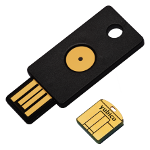

\pagestyle{plain}

# Introduction

In almost every authentication process a password is required. There are a lot
of services and applications with password authentication and the amount of
passwords to remember increases continuously. Unfortunately in many cases 
the chosen passwords aren't secure enough. Which means they can be cracked
e.g. by dictionary attacks. But even if you have chosen a secure password there
are other risks e.g. the service it is for could leak it. At this point
two factor authentication could be a security improvement. Two-factor
authentication in general consists of something you know and something you have.
The YubiKey is a hardware token for two-factor authentication. It's the physical
part within the two-factor authentication. In comparision to other two-factor
authentication solutions the YubiKey has some advantages. Besides that, the
paper will give an overview of the various use cases, explains the basic concepts
and introduces the hardware of YubiKey. Furthermore companies use the YubiKey to
protect their data and systems. This point also will be covered in the paper.

[^ZFS]: A combined file system and logical volume manager designed by Sun Microsystems
[^BTRFS]: ,,B-tree FS" A copy-on-write linux file system with similar features
to zfs

# Hardware and basic concepts

First of all it's interesting to know how the YubiKey looks and which material
is used. The size of YubiKey is 18mm x 45mm x 3mm and the weight is 3 gram.
Which means it's a very light weight device. The used material is crush- and
water-resistant. One of the advantages the YubiKey has. There are five versions
of YubiKey available. In addition there are YubiKeys much smaller than the
common size. It's called the Nano version. [Fig. 1](# [On the left, YubiKey Standard - on the right, YubiKey Nano.) shows the Standard YubiKey
and the YubiKey Nano version. The following
table shows the different versions of YubiKey. A more detailed table could be
find on ......

## Acts like a USB keyboard

The basic idea is that YubiKey acts like a keyboard when it is plugged into a
USB port. Which means there is no need for additional drivers or client
software. The YubiKey will be identified as a standard USB Human Interface
Device (HID). Therefore it's possible to use the native system drivers. 
Furthermore no battery is needed. 

## Basic handling

touch the YubiKey, generates password
2 slots
LED indicator

## Where can it be used

disk encryption
computer login
internet services
...

<!--
MICRATHENE
MICRATHENE
MICRATHENE: Versuche mal mit den Virtuellen Desktops von Gnome zu arbeiten um
dich nicht so mit dem hin und her klicken zu verwirren alt + strg + pfeil oben | unten
Und auf dem linken Bildschirm hast du dein PDF, kannst du auch auf n Virtuellen
Desktop tun!

MICRATHENE!!! nicht vergessen dann :set filetype=pandoc zu machen nachdem du die
tabelle bearbeitet hast!
-->

+-----------------------+---------------------------+--------------------------+---------------------------+---------------------------+----------------------------+
|                       |  **YubiKey 4**            | **YubiKey Neo**          | **Fido U2F**              | **YubiKey Edge**          | **YubiKey Standard**       |
+=======================+===========================+==========================+===========================+===========================+============================+
| *Static Passwords*    |  \color{green}{\ding{52}} | \color{green}{\ding{52}} |  \color{red}{\ding{56}}   | \color{green}{\ding{52}}  | \color{green}{\ding{52}}   |
+-----------------------+---------------------------+--------------------------+---------------------------+---------------------------+----------------------------+
| *YubiKey OTP*         | \color{green}{\ding{52}}  | \color{green}{\ding{52}} |  \color{red}{\ding{56}}   | \color{green}{\ding{52}}  | \color{green}{\ding{52}}   |
+-----------------------+---------------------------+--------------------------+---------------------------+---------------------------+----------------------------+
| *OATH - HOTP*         |  \color{green}{\ding{52}} | \color{green}{\ding{52}} |  \color{red}{\ding{56}}   | \color{green}{\ding{52}}  | \color{green}{\ding{52}}   |
+-----------------------+---------------------------+--------------------------+---------------------------+---------------------------+----------------------------+
| *OATH - TOTP*         |  \color{green}{\ding{52}} | \color{green}{\ding{52}} |  \color{red}{\ding{56}}   | \color{green}{\ding{52}}  | \color{green}{\ding{52}}   |
+-----------------------+---------------------------+--------------------------+---------------------------+---------------------------+----------------------------+
| *PIV*                 |  \color{green}{\ding{52}} | \color{green}{\ding{52}} |  \color{red}{\ding{56}}   | \color{red}{\ding{56}}    | \color{red}{\ding{56}}     |
+-----------------------+---------------------------+--------------------------+---------------------------+---------------------------+----------------------------+
| *OpenPGP*             |  \color{green}{\ding{52}} | \color{green}{\ding{52}} |  \color{red}{\ding{56}}   | \color{red}{\ding{56}}    | \color{red}{\ding{56}}     |
+-----------------------+---------------------------+--------------------------+---------------------------+---------------------------+----------------------------+
| *Fido U2F*            |  \color{green}{\ding{52}} | \color{green}{\ding{52}} |  \color{green}{\ding{52}} |  \color{green}{\ding{52}} | \color{red}{\ding{56}}     |
+-----------------------+---------------------------+--------------------------+---------------------------+---------------------------+----------------------------+
| *Secure Element*      |  \color{green}{\ding{52}} | \color{green}{\ding{52}} |  \color{green}{\ding{52}} |  \color{green}{\ding{52}} | \color{red}{\ding{56}}     |
+-----------------------+---------------------------+--------------------------+---------------------------+---------------------------+----------------------------+
| *Online Applications* |  \color{green}{\ding{52}} | \color{green}{\ding{52}} |  \color{green}{\ding{52}} |  \color{green}{\ding{52}} |   \color{green}{\ding{52}} |
+-----------------------+---------------------------+--------------------------+---------------------------+---------------------------+----------------------------+

# Features
 
## One Time Password

Generating one-time passwords (OTP) was the basic function in early days of the
YubiKey. Each one-time password works only once. It is used in combination with
username and password. [Fig. 1] (#OTP) 

## Static Password
## Fido U2F
## OpenPGP
## Near-Field-Communication (NFC)
## PIV?
## Secure Element?
## Challenge Response
## Online and offline Applications

# Configuration

# YubiKey for Business
# Comparision with other Solutions

[^gcrypt]: Encryption tool for git repositories, https://github.com/bluss/git-remote-gcrypt
[^gpg]: GNU Privacy Guard, a free tool that implements public key cryptography

# Conclusion 

\newpage

# References
