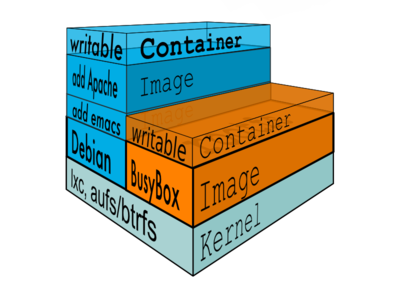
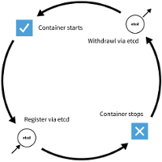

---
documentclass: llncs
title: Docker -- Application containers and sandboxing
author: Christopher Pahl
institute: University of applied science Augsburg
email: "christopher.pahl@hs-augsburg.de"
keywords: docker, deployment, container, sandbox
abstract: | 

    Docker is a new approach to deployment targeted at making distributing
    software easier and faster. Instead of true hardware virtualization,
    software is run in containers which are easily reproducible and can be
    versioned. The containers can be easily exchanged either raw of over
    a common platform like DockerHub. Besides deployment, docker can be used
    for tasks like sandboxing, creating testbeds for small to large
    applications and generally as an alternative for many usecases where
    hardware virtualization was used previously.
...


# Introduction

The task of software deployment is still considered as very hard by many
distributors. Modern software is characterized by relying on many external,
heterogeneous components (e.g. external libraries or databases) which will be
called dependencies hereafter. While this is a good for preventing the
reimplementation of already solved problems, the dependencies may change
drastically themselves over time. This makes it very hard for all parties to
maintain a consistent, working state.

Since dependencies are developed by their own respective developers, changes can
result in broken Application programming interfaces (APIs) which result in
broken compilations or in more subtle changes where the API stays the same but
behaves slightly different. In any case the software will be broken under
certain circumstances, causing bug reports by the user. The exact circumstances
where the error occurs is often hard to reproduce for the developer, often
leading to a ``cannot reproduce`` state of the bug report.

Current state of the art is using hardware virtualization techniques which
solves the problem above, but with major drawbacks for the user. On the one hand
the virtual images created by tools like VirtualBox @virtualbox or VMWare
@vmware are very huge (often several Gigabyte in size) and therefore hard to
transfer. Additionally they are usually not versioned, so the full image needs
to be transferred on every update. Furthermore, virtualized applications usually
run slower than native applications - which is especially tough for scientific
usage.

Many developers are not even fully aware of these difficulties. The software is
either distributed as binary blob for proprietary software or as source code
archive for Open Source Software (ref). In the first case the user has only a
slight chance of getting the software working when he has incompatible
dependencies. In the latter case the user is able to compile the software
himself, possibly using the correct, working dependency. But in both cases the
problem is shifted to the user of the software, while this is a clear problem of
the original developer, especially if he is offering his product in a commercial
way.

# Application Containers

In Marc 2013 ``Docker`` was released by *dotCloud* @dotcloud (a Platform as a Service
company). The application, which is written entirely in Google's programming
language *Go*, soon gathered attention from many large companies including
Microsoft @dockerblog, IBM and others since they have seen ``Docker`` as a promising
solution to the problems described above. 

Docker is in it's core a program that makes it possible to run applications in
*containers*. In this case, a container always consists of an operation system
image and of the application that is supposed to run in it. This paper is based
on Docker version, ``1.3.1``, being the latest stable version.

Images are usually stripped down linux distributions [^windows], with all 
unnecessary packages removed -- this includes for example the ``X.org`` display
server, making it not possible to run gui applications inside of images by
default. These images are often called *base images*, to indicate that we are
supposed to create our own version based on them.

Applications that run inside of the container have a full copy of the filesystem
in the image which they can modify at will. By default, the application has no
way of accessing the host's resources, since the kernel of the host starts all
*dockerized* application in a new *namespace*. This allows the container
application to have their own process ids, hostname, mount points and IPC
primitives. 

All communication of the containers are done internally via the docker daemon
``dockerd``, which is a system service that run on the host system and handles
all containers on a single system.

[^windows]: This could change soon with the upcoming windows support. 

## Workflow

In order to pack an application inside of an container one has two options:

1) Download one of the many base images from *DockerHub* and modify it by
   running a shell inside of it. Inside this shell it is possible to modify 
   the container to the developer's needs. For example, he might use the linux 
   distribution's package manage in order to install a webserver (the
   dependency), his application that runs on top of it and possibly populates
   a database with the data needed for the application.
2) The above method is tedious if many containers need to be created, all of
   them with minimal configuration changes. In this case this process can be
   automated via a so-called ``Dockerfile``. A ``Dockerfile`` is basically a
   list of commands needed to reproduce the container from a base image (which
   must be stated on the first line). The image can be built with a single 
   docker command that pulls the base image and applies each command on it
   automatically. With small amounts of scripting it is possible to create 
   slightly different configurations for every build.

While the second option is a lot mightier and faster on the second run, the
first one is the default for many usecases. Following a short demonstrative
commandline session is given to illustrate the said:

As a convention, the line starts with ``$`` if it was executed on the host
system and with ``>`` if it is run inside of a container.

```bash
$ docker images  # List all available images on the host
 REPOSITORY   TAG         IMAGE ID      CREATED       VIRTUAL SIZE
 fedora       latest      7d3f07f8de5f  9 weeks ago   374.1 MB
 base/arch    2014.04.01  a64697d71089  7 months ago  277.1 MB
 base/arch    latest      a64697d71089  7 months ago  277.1 MB
 
# Specify the image and the application (echo here) to create a container
$ docker run base/arch echo "hello world"
hello world

# Run an shell inside the container, 
# -i means "catch stdout", 
# -t means "create a tty for the shell"
$ docker run -i -t base/arch bash
> echo "hello world"
hello world
```

## Technical aspects



The [Container example][Container example] shows the layers used in docker. Two
containers (Debian and BusyBox) are shown that both run on the same kernel and
have a different level of versioned commits]

The biggest difference to other commonly used techniques is that all
applications run on the same operating system, which means on the same kernel,
but with a different userspace. This allows the sandboxed application to
directly access the hardware over a thin layer of linux kernel techniques. This
lies contrast to true hardware virtualization where a whole new kernel is
started on emulated hardware.

This thin layer is ``cgroups``. It allows the grouping of processes and creating
the already mentioned namespaces for them. Additionally it is possible to
configure the ressources that a group of processes may use in a fine-grained
way. All processes in a docker container run in such a process group, therefore
every container can be configured in the same way.

Since ``docker`` containers are versioned, containers need a way to write their
changes into a staging area, so the original container is not modified until the
developer decides he wants to commit his staged changes. For this purpose
``docker`` uses a overlay filesystem. ``Docker`` can use both ``aufs`` or
``btrfs``. ``aufs`` for example provides a read- and writable overlay over a
normal filesystem which is only readable through ``aufs``. All written changes
are cached until a synchronization is requested.


In order to make ``docker`` easily extendible and controllable, the tool is
split up in a daemon called ``dockerd`` and ``docker clients`` which are usually
the commandline ``docker`` utility and also each application container.
This split up also allows a clean language agnostic extension approach since 
all communication goes over a defined network protocol. Therefore it is easily
possible  to develop remote control software that is able to list all
containers, show statistics of them and to start or stop them. The open source 
webtool ``Shipyard`` ([Example](shipyard)) is an example for such a remote control.

# Use cases

## Deployment

This is the main usecase of ``Docker``. 
In the following example we (pre)install a simple application inside of an
container and will publish it.

```bash
$ docker run -i -t base/arch bash
> # Use arch linux' package mananger named pacman
> # to install a random application. (output skipped)
> pacman -Syy cowsay
> exit  # We modified the container now
$ docker ps -a   # Lookup the container's name.
CONTAINER ID IMAGE                COMMAND     NAMES
42cb46e2430f base/arch:2014.04.01 "/bin/bash" silly_lovelace       
$ docker diff silly_lovelace  # Lookup what changed.
A /usr/bin/cowsay
...
$ # Commit the changes 
$ docker commit silly_lovelace sahib/cowsay_arch
$ docker images  # New image named sahib/cowsay_arch
REPOSITORY        TAG    IMAGE ID     CREATED     VIRTUAL SIZE
sahib/cowsay_arch latest b856d3cec500 2 weeks ago 283 MB
$ docker run -i -t sahib/cowsay_arch cowsay hello
< hello >
        \   ^__^
         \  (oo)\_______
            (__)\       )\/\
                ||----w |
                ||     ||
```

As you can see, we created a new image called ``sahib/cowsay_arch``. 
We can directly start the application by naming it after ``docker run``. 
Now we can publish this image on *DockerHub*, a platform for exchanging user
created containerized applications. The key to this are the base images found on
DockerHub @dockerhub, so instead of pushing the full 283 Megabyte for our example we will
only push the difference to the archlinux base image -- which is about one
megabyte. This near megabyte happens to be the size of the ``cowsay`` utility we
installed. 

```bash
$ # Before accessing DockerHub, we need to register/login to DockerHub.
$ # This needs to be only done once, since it saves it's session. 
$ docker login --email sahib@online.de -u sahib -p secret
$ docker push sahib/cowsay_arch
Sending image list
[...]
```

Enterprises can install the DockerHub software on their intranet, so they don't
need to push their proprietary software to a potentially untrusted public
server outside of the entreprise's control. By default the *official*
DockerHub at https://hub.docker.com is used.

After pushing, the client side can pull the container, provided they have a
running ``dockerd`` daemon. Pulling involves either downloading the full image
on the first run (``docker`` does dependency resolution if the base image is not
present yet) or only the difference will be fetched and applied.

```bash
# Looks up the image cowsay_arch in the user sahib's account.
$ docker pull sahib/cowsay_arch
[...]
$ docker run -i -t sahib/cowsay_arch cowsay hello
[...same as above...] 
```

## Sandboxed application testbeds

From a developer's point of view it is often needed to test an untrusted
application on real production data. While it's always possible to set up a test
server with a copy of the data is an tedious task. It is desirable to simply do
this work once and, if needed, to reset to the last working state. While this
might be possible with other techniques like snapshotting filesystems or *true*
hardware virtualization it is slow to restore the made damage compared to just
restarting the ``Docker`` container. 

```bash
$ docker run -i -t base/arch:latest bash
> rm -rf / # Simulate destructive application
> exit
$ docker run -i -t base/arch:latest bash
> ls   # Everything back.
bin  boot  dev	etc  home  lib	lib64  mnt  opt  
proc  root  run  sbin	srv  sys  tmp  usr  var
```

A related usecase: third party applications that cannot be trusted can be easily
executed inside a container. If they decide to do malicious actions the host
system cannot be compromised. An usage of this principle would be running a
browser inside of a ``Docker`` container to visit potentially unsafe websites
(e.g. with Adobe Flash) [^chromium]. 

    
[^chromium]: An implementation of this idea can be found here: https://github.com/jlund/docker-chrome-pulseaudio

## Package and cluster management

Since it is possible to run many instances of the same application in many
containers, ``Docker`` can be used for efficient load balancing too. In contrast
to hardware virtualization techniques the balanced applications even run with
native speed. Sadly, the amount of tools for load balancing and similar cluster
management shipped along ``Docker`` is still quite small. Therefore the *CoreOS*
@coreos provides a stripped down Linux distribution for servers that uses ``Docker`` as
it's package manager. 

It builts on the upcoming and already well-established init system ``systemd``
to manage all services running on the server or cluster. ``systemd`` requires
one to write a so-called Unit-file to be able to start, stop and monitor a
service. Basically it is a key-value mapping of events and the commands that
should be executed in this case. Additionally the dependency of the unit can be
configured, so ``systemd`` can start all dependency units needed to start a
service. 

For *CoreOS* the unit files will usually start docker containers and might for
example look like this:

```
[Unit]
Description=HelloService
Requires=docker.service
After=docker.service

[Service]
ExecStart=/usr/bin/docker run busybox \
 /bin/sh -c "while true; do echo Hello World; sleep 1; done"

[Install]
WantedBy=multi-user.target
```

For a cluster where every machine runs on *CoreOS*, it would be cumbersome to
manually distribute the unit files over network and start each of them.
Therefore *CoreOS* ships a utility called *fleet*, which is able to distribute
the unit file over the cluster and the associated docker containers and act as a
wrapper to start and stop a service across a cluster using ``systemd``. 


As seen in the [fleet architecture overview with two services being
distributed](CoreOs architecture), two services are distributed (two load
balancer instances and six api servers that do the actual work). If one of the
load balancers breaks down another one can be started on another machine by
``fleet``. Through standard linux daemons like ``avahi``, *CoreOS* instances can
be discovered on the network, so adding new machines to the cluster is very
easy. 



Since *CoreOS* needs a way to track which container runs on which machine, a
global configuration daemon is needed. This daemon is called ``etcd``. As one
can see in the [etcd overview](etcd overview), new containers automatically get
registered in the key-value store of ``etcd`` and unregistered once they stop. 
Each machine runs one ``etcd`` instance, which mirror their state all over the
cluster.

Furthermore, applications can use the key-value store for reading, writing and
listening on certain keys. So application relevant data can be easily shared all
over the cluster with minimal efforts. Additionally values can be watched for
changes, so use-cases like watching an operation to finish and executing another
task that relies on the data is possible.

An example of *CoreOS* is beyond the scope of this paper. 

# Advanced features

Until now we only had simple cases where only a single application runs inside a
container. But real server software usually comes in many parts. For example one
database backend, one analyzer engine, one webserver and many more small
applications in between. Even worse, those application need to communicate over
sockets, share data from a common mounted volume or just need to forward their
network ports to the outside. This is all possible though with the extended
features discussed in the following.

### Port forwarding

If a *dockerized* application needs to wait for connections from the outer side 
they need a port to listen on. By default docker containers can make connections
to the outside, but the outside world cannot connect to the container. In order
to make this work, ``docker`` needs to know which port in the container should
be mapped to a port on the host system. This is problematic in a case where two
containers want to export the same port to the outside -- which is often the case
when launching several instances of the same application in different
containers for e.g. load balancing. 

While it is possible to directly map the container port the host port,
``docker`` will map a random high port (49153 to 65535) on the host to the port
used inside the container if the ``-P (--publish-all)`` was given. This allows
running several instances of the same application simultaneously. 

The actually used port can be looked up using the ``docker ps`` command which
lists currently running containers:

```bash
$ docker ps
CONTAINER ID IMAGE      COMMAND CREATED    STATUS    PORTS               
7ee05a7cf76e sahib/arch "bash"  4 days ago Up 2 days 0.0.0.0:49155->5000/tcp
```

### Volumes

Some components of an application might need to share a common directory where
they can save or read data from. This is a common usecase for database
application where the database server reads the data and occasionally another
application generates new data and writes it to the common mount. While it would
be possible to use a common network share (like ``nfs``), this would be neither
very efficient nor would be controllable from the ``docker`` utility.

Therefore ``docker`` offers an easier alternative as so-called *Data Volumes*.
Those are simply directories on the host system that get mapped to a directory
inside of the container on it's startup. In contrast to all other directories
inside the container those directories can be used to persistently store data
that will be available after a restart of the container.

Here is a short example of using this feature:

```bash
$ mkdir /tmp/webapp
$ # create a data volume on /tmp/webapp on host,
$ # which will appear on /webapp in the container.
$ docker run -v /tmp/webapp:/webapp base/arch bash
> ls /webapp
(empty)
$ touch /tmp/webapp/new_file
> ls /webapp
new_file
```

### Linking containers

As previously mentioned, big application often come in several parts. It would
be favourable if we could separate those parts in individual containers, but
somehow tell ``docker`` they're part of something bigger. This is supported by a
feature called *Container linking*.

In order to establish links we need to give containers a name. By default
``docker`` will name containers by two words that are connected with an
underscore (e.g. ``silly_lovelace``). Since linking needs a predictable name, one can
give an explicit name by passing ``--name predictable_name`` to the respective
``docker`` commands. 

Here is a very short demonstration of the linkage feature:

```bash
$ # Start container "one" as usual 
$ docker run -i -t --name one base/arch bash
$ # Start container "two" with "one" as source
$ # and the link name (everything after :) "link_one"
$ docker run -i -t --name two --link one:link_one base/arch bash 
two> ping one
[root@c47d78d66182 /]# ping one
PING one (172.17.0.11) 56(84) bytes of data.
64 bytes from one (172.17.0.11): icmp_seq=8 ttl=64 time=0.081 ms
[...] 
two> # If we would like to get a url to port 8080 of "one"
two> # we can check the environment variables docker exposes
two> echo $ONE_PORT_8080_tcp
two> echo $ONE_NAME 
/two/one
tcp://172.17.0.11:8080
one> ping two
ping: unknown host two
```

As one can see, after linking the container ``two`` to the container ``one`` by
using the ``--link source_container:link_alias`` we can reach the source
container over network, but not the other way round. Each linked container
can access it's source container by it's hostname. Furthermore ``docker`` sets
up some environment variables that tells us in a programmatic way the exact
address data of the source container.

One could have done all of the above all by exposing a set of defined ports. The
advantage of linking is that we don't need to expose our application to the
network for security reasons.

# Conclusion

## Advantages

After showing a brief overview over the features that docker provides, we want
to look at it from a higher perspective and name some general advantages:

- *Portability*: Docker strives to support most popular operating system. 
  Since development started on Linux, it is still the best supported platform. 
  Other platforms currently still use *true* hardware virtualization to run a
  linux container or will need to use it when the host kernel is not compatible
  (e.g. when running a Linux container on Windows or vice versa). 
  This is the main reason why ``docker`` is not an competitor to tools like
  *VirtualBox* or *VMWare*, rather an alternative or extension. 
- *Lightweight*: In the normal usecase containers start in under a second and
  are able to directly access the underlying hardware without serious
  restrictions. This makes it e.g. possible to use the host system GPU normally,
  which is a hard to impossible task in *VirtualBox*.
- *Developer friendly:* Developers can install their software in the system they
  know best and configure it in a way it works best. Furthermore, they 
  need to worry much less on making the software portable onto many platforms,
  often making the code hard to follow and preventing features that would not
  be available on all platforms.
- *Common standard:* ``Docker`` can provide a common standard for package
  deployment, possibly being an replacement for all the competing package
  formats like ``.msi`` packages on Windows or ``.deb``, ``.rpm``, ``.tar.xz``
  on Linux or elsewhere.

Other alternatives like ``packer`` @packer or ``vagrant`` @vagrant [^vagrant]
can be used together with ``docker`` in scenarios where hardware virtualization
is requested (for security reasons or to be compatible with existing load
balancing software) but also easy deployment option are needed.

[^vagrant]: Both tools are wrappers around popular hardware virtualization
techniques, offering a similar interface to ``docker``.

## Criticism

There are some points that are criticized about the approach ``docker`` is
taking. The points listed here may or may not apply to a particular usecase, but
are at least worth a mention. 

- Docker makes writing bad software easier by making it possible to ship "hacks"
  that would not be acceptable for normally deployed software.
- High configuration for complex applications, though it only needs
  to be done once (plus the effort is on the developers site).
- Docker is developed by a commercial enterprise. Even though it is free open
  source software, they have large control over the direction the developement
  is going.
- All communications goes over ``dockerd`` which introduces a single point of
  failure and potential security hole. If the daemon crashes, all containers 
  may act undefined for at least a short time.
- GUI Applications can be shipped, but need more packages in order to render
  their graphical interface. On linux this would require the X.org server and
  similar components. This would make the difference from the base image far
  larger, rendering docker's advantage less useful. It would be however useful
  to create base images that include those packages already, so the download
  would need to be done only once. 

## Summary

While ``docker`` is not a new technology by any means (operating system level
virtualization dates back to the last millenium @goldberg1981hardware) it is a
welcome renaissance of this old deployment technique. In contrast to it's
competitors, ``docker`` makes it painless to create working containers and
*ship* them to the client side. Future development might improve the current
portability issues and might deliver integration in other products. The
development started in 2013 and still new features come in a weekly rate. 

It should be noted that none of this is really new, since there many competing
operating system level virtualization techniques exist already like *LXC*, plain
*chroot* or *FreeBSD jails*. But none of them are as portable and easy to use as
``docker``. Therefore, ``docker`` tries to be a standard that developers and
users can agree on and less a new technique.

\newpage

# References
