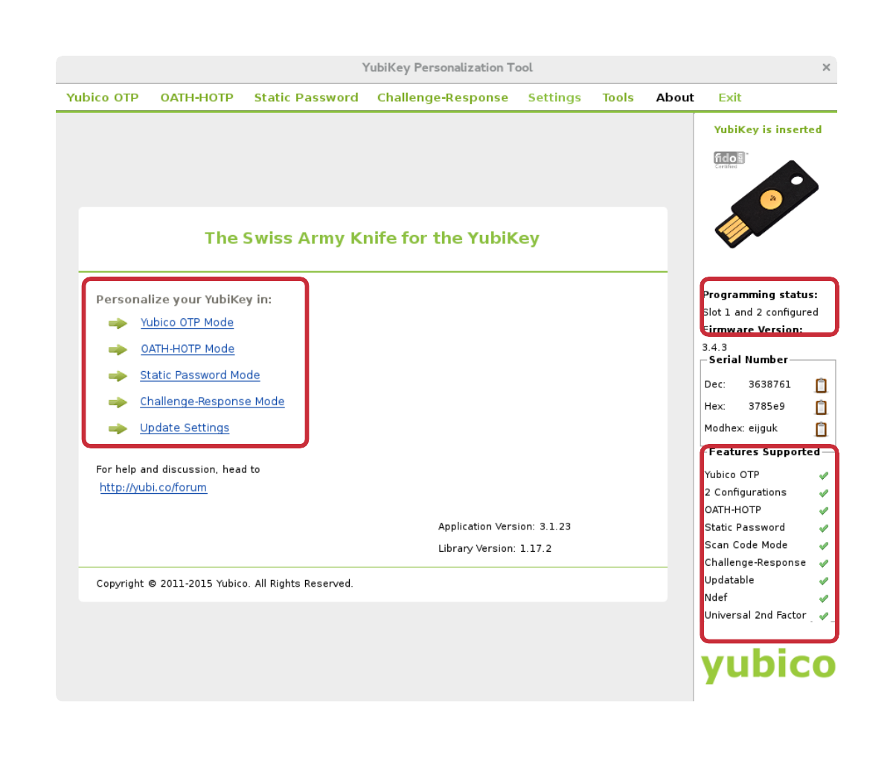

\pagestyle{plain}

# Introduction

In almost every authentication process a password is required. There are a lot
of services and applications with password authentication and the amount of
passwords to remember increases continuously. Unfortunately in many cases 
the chosen passwords aren't secure enough. Which means that they can be cracked
e.g. by dictionary attacks. A statistic of chosen passwords in 2013 shows
the password *123456* as most used one [@statista]. But even if you have chosen a secure password there
are other risks. For example the service it is for could leak it. At this point
two factor authentication could be a security improvement. Two-factor
authentication in general consists of something you know and something you have.
The YubiKey is a hardware token for two-factor authentication. It's the physical
part within the two-factor authentication. In comparision to other two-factor
authentication solutions the YubiKey has some advantages. Besides that, the
paper will give an overview of the various use cases, explains the basic concepts
and introduces the hardware of YubiKey. Furthermore companies use the YubiKey to
protect their data and systems. This point also will be covered in the paper.

# Basic information

The YubiKey was developed and manufactured by Yubico. In autumn 2015 the *YubiKey
4* was released, the 4th generation since the foundation of Yubico in 2007.
In order to understand the whole concept of YubiKey a few basics are shown in the
next steps.

## Two-factor authentication

Two-factor authentication consists of something you know and something you
have
[(see Fig. 1)](# [Concept of two-factor authentication.).
The first factor is usually a username and password. The second factor is a
physical token, in this case the YubiKey.

## Acts like a USB keyboard

The basic idea is that the YubiKey acts like a keyboard when it is plugged into a
USB port. Which means there is no need for additional drivers or client
software. The YubiKey will be identified as a standard USB Human Interface
Device (HID). Therefore it is possible to use the native system drivers. 
Furthermore no battery is needed. Similar to any other USB keyboard the
YubiKey is a USB 1.0/2.0 device[@manual chapter 2]. 

## The hardware token

The size of the YubiKey is 18mm x 45mm x 3mm and the weight is 3 gram.
Which means it is a very light weight device. The used material is crush- and
water-resistant. [Figure 2](#token) shows the YubiKey. There is a touchbutton in
the middle of the YubiKey. It is a solid-state capacitive touch sensor which
means it works with a human finger but not with other things touching it by
accident. The figure also shows the USB contacts and the
hole to put it on a keychain.

There are five versions of YubiKey available (see table @tbl:demo). The
amount of
functions grows from the first YubiKey (YubiKey Standard) to the latest (YubiKey
4). A special one is the FIDO[^Fido] U2F[^U2F] which only works with U2F compliant
    applications. The features and funtions will be explained in
    [chapter 3](#functions). 
In addition there are YubiKeys much smaller than the
common size. Those are called the *Nano* version.

[^Fido]: FIDO = the open-authentication industry consortium
[^U2F]: U2F = Universal Second Factor

<!-- 
-->

----------------------------------------------------------------------------------------------------
                                YubiKey      YubiKey       YubiKey      Standard          FIDO
Function/Feature                      4          Neo          Edge       YubiKey           U2F
--------------------------    ---------   ----------     ---------     ---------     ---------
Static Passwords              \ding{52}   \ding{52}      \ding{52}     \ding{52}     \ding{56}

YubiKey OTP                   \ding{52}   \ding{52}      \ding{52}     \ding{52}     \ding{56}

Smartcard (OpenPGP)           \ding{52}   \ding{52}      \ding{56}     \ding{56}     \ding{56}

Fido U2F                      \ding{52}   \ding{52}      \ding{52}     \ding{56}     \ding{52}

Online Applications           \ding{52}   \ding{52}      \ding{52}     \ding{56}     \ding{52} 
----------------------------------------------------------------------------------------------------

Table: YubiKey versions and some of their functions and features. {#tbl:demo} 

## How it works

Everytime the YubiKey is plugged into a USB port and the touch sensor is
pressed, it executes the configured function. For example it generates an
one-time password. The generation of one-time passwords will be explained in
part [3.1](#otpexplain). There are two slots which can be configured. The first slot can 
be accessed with a short press (0.3 - 1.5 seconds) and the second slot can be accessed
with a long press (2.5 - 5 seconds) [@manual chapter 4.1]. There is also an LED indicator signaling
the current state of the YubiKey. If the YubiKey is ready to work there is a
steady green light. A rapidly flashing light means some kind of error.

<!--
MICRATHENE
MICRATHENE
MICRATHENE: Versuche mal mit den Virtuellen Desktops von Gnome zu arbeiten um
dich nicht so mit dem hin und her klicken zu verwirren alt + strg + pfeil oben | unten
Und auf dem linken Bildschirm hast du dein PDF, kannst du auch auf n Virtuellen
Desktop tun!

MICRATHENE!!! nicht vergessen dann :set filetype=pandoc zu machen nachdem du die
tabelle bearbeitet hast!
-->

<!--
+----------------------+----------------+-----------------+------------------+----------------------+--------------+
|                      |  **YubiKey 4** | **YubiKey Neo** | **YubiKey Edge** | **YubiKey Standard** | **Fido U2F** |
+======================+================+=================+==================+======================+==============+
|  Static Passwords    | \ding{52}      | \ding{52}       | \ding{52}        | \ding{52}            |  \ding{56}   |
+----------------------+----------------+-----------------+------------------+----------------------+--------------+
|  YubiKey OTP         | \ding{52}      | \ding{52}       | \ding{52}        | \ding{52}            |  \ding{56}   |
+----------------------+----------------+-----------------+------------------+----------------------+--------------+
|  Smartcard (OpenPGP) |  \ding{52}     | \ding{52}       | \ding{56}        | \ding{56}            |  \ding{56}   |
+----------------------+----------------+-----------------+------------------+----------------------+--------------+
|  Fido U2F            |  \ding{52}     | \ding{52}       |  \ding{52}       | \ding{56}            |  \ding{52}   |
+----------------------+----------------+-----------------+------------------+----------------------+--------------+
|  Online Applications |  \ding{52}     | \ding{52}       | \ding{52}        |   \ding{52}          |  \ding{52}   |
+----------------------+----------------+-----------------+------------------+----------------------+--------------+
-->

# Functions and Features {#functions}

The YubiKey offers various functions and features depending on its version (see
table @tbl:demo).
The major function is to generate one-time passwords. Because of this the
one-time password function will be shown in more detail. Other functions are for example the static password, connection
via NFC [^NFC], smartcard or Fido U2F. 

[^NFC]: Near-Field-Communication

## One Time Password {#otpexplain}

Generating one-time passwords (OTPs) was the basic functionality in early days of the
YubiKey. Each one-time password works only once. With the YubiKey it is possible to use three
different implementations of one-time passwords. On the one hand the YubiKey
OTP, developed by Yubico. On the other hand OATH-HOTP and OATH-TOTP, both
open authentication standards specified by OATH, the Initiative for Open Authentication. At this point the
paper will go into detail on the YubiKey OTP. 

A touch on the integrated sensor triggers the one-time password generation.
Figure [3](#Generated one-time password. Consists of tow major parts: The YubiKey ID and
the encrypted passcode.) shows the output of touching the YubiKey. The
one-time password consists of two major parts, the YubiKey ID and the encrypted
passcode. The YubiKey ID identifies a YubiKey, it is unique and never changes.

The second part is the encrypted passcode. In the YubiKey Manual
[@manual] and YubiKey Security Evaluation [@security] the general concept of
generating this part of the OTP is described as follows:

Maltitude factors are combined to form a byte string. These factors are a
private ID, usage counter, timestamp, session usage counter, random number and
checksum. In the next step, the byte string is encrypted with a 128-bit
AES[^AES] key.
Additionally the now encrypted Hex-byte string is encoded to a ModHex string. That
was made to stay independent from language settings of the operating system.

After matching the YubiKey ID, 
the validation server first converts the string back to a byte
string [see Fig. 4]. The next step is to decrypt the string with the same 128-bit AES key
used by the YubiKey for encrypting. After verifying the checksum and additional
fields, the received counter is compared with the stored one. If it is lower or
equal to the stored value on the validation server, the one-time password is rejected.
Is the counter greater than the stored value, the one-time password is valid
and the received counter value is stored.

[^AES]: Advanced Encryption Standard

## Static Password

In the white paper *YubiKey Static Password Function* [@static] the developer of the
YubiKey delivers insight to the background of static passwords concerning the
YubiKey. Of course, static passwords are not as secure as one-time passwords but
not any application supports one-time passwords. For this reason the static
password function was implemented. It's an combination of 16 to 64 characters or
numbers. It is recommended to combine the static password with a manually
added part. [Figure 5](#Static password) shows an example. The word *banana*
is manually added to the generated 16 chars static password.

## Further functions and features

**Smartcard (OpenPGP):**
The latest versions of YubiKey presents itself to the host not only as USB device, it
supports also smartcard functionality via CCID[^CCID]. An application in the context of
data security is for
example to store OpenPGP keys. PGP stands for Pretty Good Privacy and is an
open standard for encrypting emails, signatures and authentication. Additionally
the stored PGP keys can be secured with a PIN.

**Near-Field-Communication (NFC):**
YubiKey in the version *Neo* supports connection via
Near-Field-Communication (NFC). Therefore it is possible to have easy to use
two-factor authentication with NFC-enabled smartphones. The YubiKey has only be
touched to the smartphone which acts as NFC reader. It depends on the
configuration and type of record but the most common one is the URI- and Text
type. Which means the YubiKey constructs a concatenation between a URI and a
generated one-time password [@manual chapter 7.2]. The following example
describes the process:

~~~
Configured URI: http://www.testsite.com/?otp=
Generated OTP: niljijfcnfdbjeduvuthuugnvuuvgrnh
Result: http://www.testsite.com/?otp=niljijfcnfdbjeduvuthuugnvuuvgrnh
~~~

**FIDO U2F:**

U2F stands for *Universal Second Factor* and is an open authentication
standard. It was created by Yubico and Google, hosted by FIDO -- the
open-authentication industry consortium. Summarized U2F could explained as a
challenge-response protocol which works in the background. It is implemented
alongside the one-time password. The user does the same as if it were a one-time
password application. There is a detailed technical description of U2F at the
developer sites on yubico.com [@u2f].

[^CCID]: Chip Card Interface Device

# Where to use the YubiKey

The YubiKey can be used for securing access to many applications. First Online
Applications and Password Managment seems to be the most interesting. Of course
there are many more applications, for example disk encryption or system login.

## Online Applications

Everyone logging in to online applications wants to secure their private data
and identity. But every day online accounts are hacked, passwords and private data
are stolen. A lot of online applications already offer two-factor authentication to add an extra layer
of security. Some of them will
be presented in the following.

<!--
Facebook on its own had 233 million daily active users in third
quartal of 2015 in Europe [@statista]. Therefore and many other applications the
YubiKey offers an additional layer of security.

**Facebook**
It is also possible to login with the facebook
account to many other online applications. Which means in this case, stolen
access data can be used to access also other applications. Using the YubiKey
to login via facebook account secures the access to the data. Of course, facebook itself
is nevertheless collecting and using the data. That is a different matter.
-->

**Google**

Google promotes the login with only one account to all of their services.
If the username and password of this accout is stolen all services can be accessed and harmed.
Particularly in this case, two-factor authentication is very helpful. Google offers
two-factor authentication with YubiKey via U2F standard [@google].

**GitHub**

GitHub is a webservice for revision control and source code management [@github].
It is possible to log in to a GitHub account with an U2F compliant YubiKey. In
order to recognize how simple it is to set up two-factor authentication with
GitHub, the steps required in the GitHub account are described:

\begin{enumerate}
    \item Enable two-factor authentication
    \item Register a new device in Settings/Security
    \item Configure a backup: Fallback SMS number or recovery codes
\end{enumerate}

**Dropbox**

Dropbox supports login with FIDO U2F enabled YubiKeys. It is also pretty simple to
set up two-factor authentication for a Dropbox account. There is a step-by-step
instruction on yubico.com [@dropbox].

## Password Management

To manage passwords, especially strong passwords, which are not easy to remember,
there are applications called password manager. But also the password manager
needs to be protected with a strong password. In this case, the YubiKey
offers an extra layer of security. Password managers offering two-factor
authentication with the YubiKey are for example KeePass [@keepass] and LastPass
[@lastpass].

# Configuration

To configure the YubiKey there is a tool called *YubiKey Personalization Tool*
[@configuration]. It is plattform independent. The following functions can
be configured: OTP (Yubico OTP and OATH-HOTP), Static Password and Challenge Response
Mode (see [Fig. 6](#YubiKey Personalization Tool.)). For all of this functions there is a quick and an advanced configuration mode.
Furthermore the tool shows which slots are configured. The default value of slot 1
is to generate one-time passwords. But this can be configured as wanted. There is also an
overview of supported features. Of course it is also  possible to configure the
YubiKey with a command line interface.

# YubiKey for Business

Enterprises have to handle the challenge to secure their data and systems.
On the one hand the YubiKey offers strong authentication and on the other hand,
it is very simple to use. Especially the simple to use concept is an important
factor for employees using the YubiKey every day.

There are many enterprises already using the YubiKey. For example Google is
using the YubiKey for all employees. Also Facebook is using it for several
applications. In an interview, John Flynn from Facebook mentioned the situation
when employees wants to read their emails somewhere else than the office. So 
the employee is asked to tap on the YubiKey and ensures that nobody is breaking
in with a stolen password [@flynn]. CERN, the European Organization
for Nuclear Research is using the YubiKey for Secure Shell (SSH) and
single-sign-on (SSO) web portal. Remi Mollon of the CERN Computer Security Team
mentioned the open algorithm and the available open-source software support as 
one of the facts why CERN is using the YubiKey [@mollon].

## Possible applications

With the YubiKey the access to a lot of applications could be improved. In the
following are some of them mentioned.

\begin{itemize}
    \item Remote Access
    \item Computer Login
    \item Securing Servers
    \item Password Management
    \item Disk Encryption
    \item Securing Cloud Solutions
    \item Identity and Access Management
    \item Securing mobile devices
\end{itemize}

## YubiKey Business Solutions

For large volume orders, Yubico offers a portable programming machine which allows customers to program
10,000 keys in one hour. If a YubiKey gets lost, the administrator can easily
disable a YubiKey so that it no longer can be used [@business]. 

<!--
Administrator kann Zugriffe einsehen, recovery-codes etc.
-->

Many applications supporting two-factor authentication with the YubiKey are also
available for business.

# Conclusion 

This paper has shown how simple it is to secure the access to private data on the
one hand and critical business data on the other hand.

<!--
Of course first there is a need to sensitise people to handle their data and
credentials more carefull. A statistic of choosen passwords in 2013 shows
the password *123456* as most used one [@statista]. And maybe this people also do not
recognize the advantages of two-factor authentication.
-->

**Positive Aspects**

To summarize the advantages of the YubiKey in few words: it is light weight,
easy to use, there are many functions and features, it is supported by many
online applications and the source code is Open Source. Additionally in
comparision to other available two-factor authentication methods, there are some
advantages. One two-factor authentication method which is often used is to
deliver an authentication code to mobile phones. On mobile phone also malware
can trigger the delivering of an authentication code. The YubiKey needs the
presence of the user touching the sensor. Furthermore the YubiKey offers
transparency on server software. That is not guaranteed on mobile phone method.
There are many more facts about this topic. A more detailed overview of
comparision the YubiKey to another two-factor authentication methods is
available on yubico.com [@compare].

**Aspects to discuss**

Of course you have to carry the YubiKey around with you. The *Nano* version
which fits exactly in the USB port can be a improvement. It needs a little time
to get used to it. Another fact which is worth of discussion is the limited
number of slots which can be configured. It is part of the philosophy of the
YubiKey. For more than two slots it would be too complicated to remember how
long to touch the sensor for which slot.

**More on the YubiKey**

There are a lot of interesting projects with the YubiKey. For example the
Massachusetts Institute of Technology (MIT) decribes in the paper *Enhanced MIT
ID Security via One-Time Passcode* [@mit] how the YubiKey could improve the
current MIT ID card. It is an card using Radio Frequency Identification (RFID)
technology and it is used to establish security across the campus by restricting
access to certain areas through scanners. They mention that the interactions
between MIT ID cards and scanners can be copied and replicated just through
sniffing. Therefore they implemented a prototype with YubiKey *Neo* and an
Android application as scanner. All in all the YubiKey is a device for
two-factor authentication worth to consider. It makes your logins secure and
keeps your information private. A topic which becomes more and more important in
todays world.

# References
